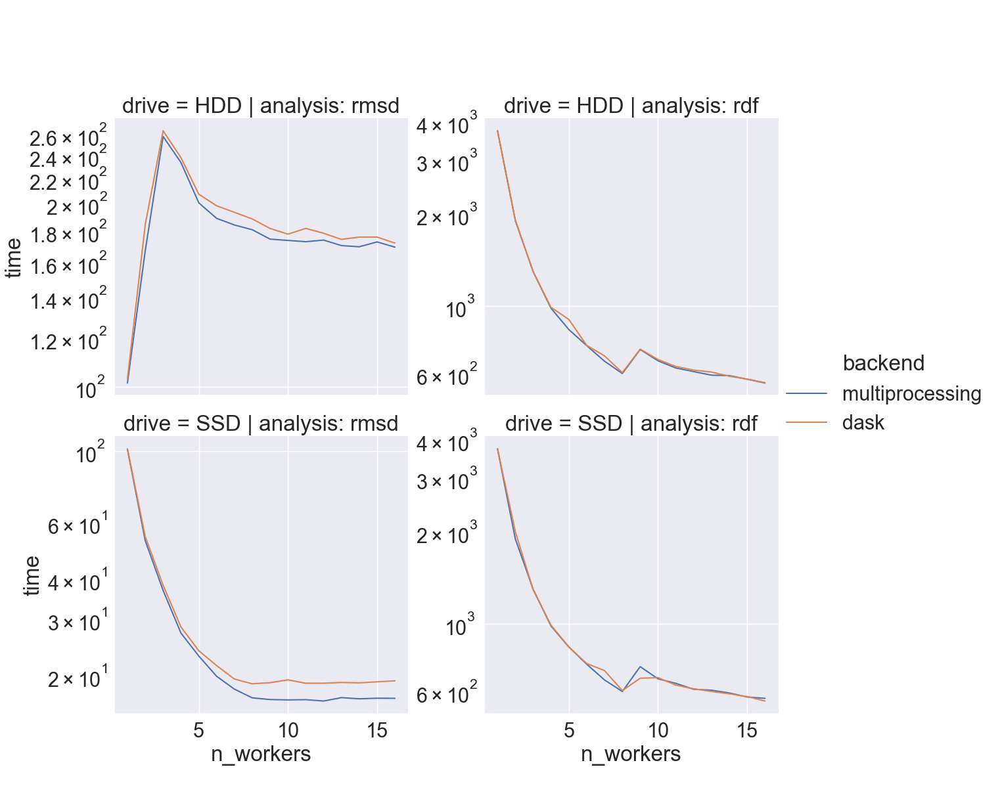
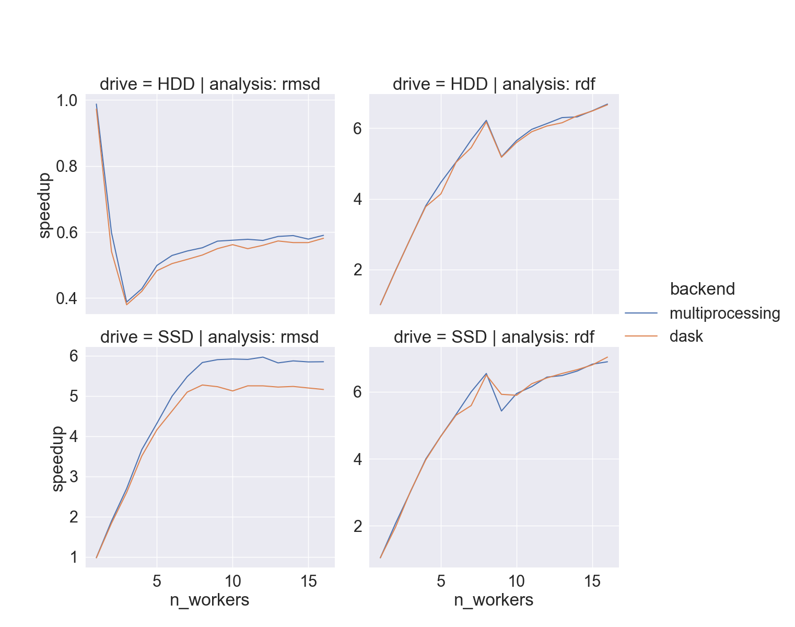
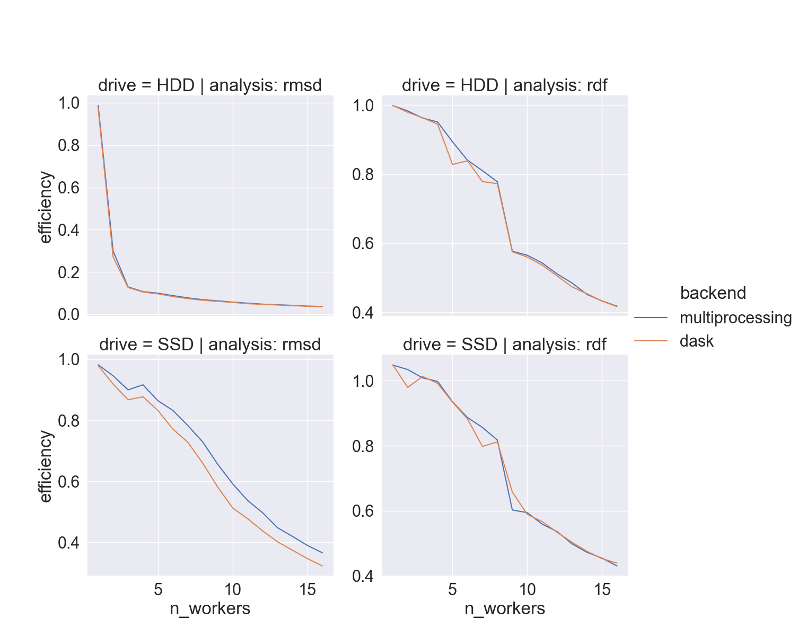

---
# website keywords
title: 'GSOC-2023: summary'
date: 2023-08-23
permalink: /posts/2023/09/mda-ugm-2023
tags:
  - gsoc
  - mdanalysis
  - presentations
  - projects

# presentation keywords
theme: uncover
_class: invert
paginate: true
---

# **Parallelization of MDAnalysis**

Egor Marin, Google Summer of Code contributor

marinegor@fastmail.com

---
# Motivation

- `T(insight) = T(simulation) + T(analysis)`
- `pmda`: 30⭐️, 21🍴 (forks)
- all MDAnalysis instances are parallelizable (courtesy @yuxuanzhuang)

---
# Goals

Change `AnalysisBase` in a way that...

1. Introduces multiple job support
   - local -- using multiprocessing?
   - non-local -- using dask?
2. Does not break existing code (subclasses, dependencies, etc)
3. Allows customization
   - add your own execution backend
   - write your own parallelizable classes


---
# Sneak peak: results

```python
>>> from MDAnalysis.analysis.rms import RMSD
>>> u, ref = ...

>>> % time long_run = RMSD(u, ref)
Wall time: 4 min

>>> % time long_run = RMSD(u, ref, backend='multiprocessing', n_workers=8)
Wall time: 50 sec
```

---
# Sneak peak: results

```python
>>> from MDAnalysis.analysis.rdf import InterRDF
>>> s1, s2 = ...

>>> % time long_run = InterRDF(s1, s2)
Wall time: 1 h

>>> % time long_run = InterRDF(s1, s2, backend='multiprocessing', n_workers=8)
Wall time: 8 min  
```

--- 
## Implementation

General `AnalysisBase.run()` protocol:

```python
def run(self, 
        start=None, 
        stop=None, 
        step=None, 
        frames=None, ...):	
  
  # prepare frames -- check boundaries, setup reader
  self._setup_frames(self._trajectory, start=start, stop=stop, step=step, frames=frames)
	
  # initialize attributes with intermediate results
  self._prepare()

  # go through trajectory 
  for i, ts in enumerate(self._sliced_trajectory, ...):
    self._single_frame()

  # convert intermediate results into final ones
  self._conclude()
```

---
## Implementation

split-apply-combine:
- split all frames into groups
- process each group independently
- combine results


---
## Implementation

Additional methods of `AnalysisBase`:
 - "split": `_setup_computation_groups()`
 - "apply": `_compute`
 - "combine": `_get_aggregator` & `ResultsGroup.merge()`
 - housekeeping: `_configure_backend`

---
## Implementation

Additional classes: `ResultsGroup`

```python
class ResultsGroup:
  def __init__(self, lookup: dict[str, Callable]): ...
  def merge(self, objects: Sequence[Results], 
            require_all_aggregators: bool = True) -> Results:
    ...
```

---
## Implementation

Additional classes: `ResultsGroup`

```python
>> from MDAnalysis.analysis.parallel import ResultsGroup, Results
>> group = ResultsGroup(lookup={'mass': lambda floats: np.mean(floats)}
>> obj1 = Results(mass=1)
>> obj2 = Results(mass=3)
>> group.merge([obj1, obj2])
{'mass': 2.0}
```

---
## Implementation

Additional classes: `ResultsGroup`

```python
# skip attributes you don't want to aggregate
>>> lookup = {'mass': ResultsGroup.float_mean, 'trajectory': Trajectory}
>>> group = ResultsGroup(lookup)
>>> objects = [Results(mass=1, trajectory=None), Results(mass=3, trajectory=Trajectory(...))]
>>> group.merge(objects, require_all_aggregators=False)
{'mass': 2.0}
```

---
## Implementation
Additional classes: `BackendBase`

```python
from MDAnalysis.parallel import BackendBase

class CustomBackend(BackendBase):
  def __init__(self, some_resource):
    self.some_resource = some_resource

  def apply(self, 
            func: Callable[T, R], 
            computations: list[T]) -> list[R]:
    results = [
      self.some_resource.do_compute(func, task) 
      for task in computations]
    return results
```

---
## Implementation
Additional classes: `BackendBase`

```python
>>> backend_instance = CustomBackend(some_resource=...)
>>> my_run = RMSD(u, ref)
>>> my_run.run(backend=backend_instance)
```

---
## Implementation
Conditions for the `backend=...`

- `Subclass.is_paralllizable() == True`
- `backend= str|BackendBase`
  - if `str`, one of built-in backends (`multiprocessing`/`dask`)
  - if `BackendBase` subclass, explicitly say `unsafe=True`

---
## Add to your subclass
Example: RMSD

```python
from MDAnalysis.analysis.parallel import ResultsGroup

class RMSD(AnalysisBase):
    @classmethod
    @property
    def available_backends(cls):
        return ('serial', 'multiprocessing', 'dask',)

    @classmethod
    @property
    def is_parallelizable(self):
      return True
    
    def _get_aggregator(self):
      return ResultsGroup(lookup={'rmsd': ResultsGroup.ndarray_vstack})
```

---
## How fast?

---


---


---


---
## When should I use it?

---


---
## When should I use it?

 - `YourClass.is_parallelizable()` for your class
 - `_single_frame()` slower than reading from disk

---
# Future features

- 🔜 add to all subclasses
   - have separate issues for complicated ones?
- 🔜 add tutorials
  - how to use parallel backends
  - how to implement your own backend subclasses

---
# Future features

- 🤔 add cluster support
  - rebrand `pmda` into MDAKit
  - focus on parallel filesystems, etc
- 🤔 add shareable memory trajectories
  - pre-load trajectory & analyze it
  - efficient for practically all subclasses
- 🤔 add `AnalysisCollection` (ht @PicoCentauri)
  - one frame read exactly once

---
# Acknowledgements

- GSOC programm
- Mentors: @yuxuanzhuang, @orbeckst, @RMeli
- all contributors🫶